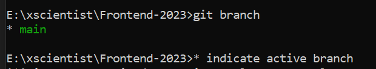

# Daily Task Submission Repository

Welcome to the Daily Task Submission Repository. To maintain organization and consistency, please follow the structure outlined below when submitting your daily tasks.

# Things to do before work

### Check active Repo
<p>
  
</p>

### Pull changes from main branch to your `branch`

```
git pull origin main
```

### Add your changes, stash them with commit and push on your `branch`.

```
git add . or git add -A
git commit -m "message.."
git push origin [branch-name]
```

## Repository Structure

The repository structure should be as follows:

Here's a breakdown of the structure:

- `UNDER_MAIN_REPO`: This is the main directory of the repository.
    - `your_name`: Create a directory with your name or username to keep your submissions separate.
      Within your directory, create a subdirectory for each daily task.
        - `task_1`, 
          `task_2`,
        - Place all files related to a specific task inside its corresponding subdirectory.

By adhering to this structure, we can easily track and review your daily task submissions. Thank you for your cooperation!

`https://xscientisttech.github.io/Frontend-2023/[folder_structure]/index.html`

### Task01
- [Jayesh](https://xscientisttech.github.io/Frontend-2023/Jayesh/Task1/index.html)
- [Kaveri](https://xscientisttech.github.io/Frontend-2023/kaveri/Task1/index.html)
- [Kiran](https://xscientisttech.github.io/Frontend-2023/kiran/Task1/index.html)
- [Prathamesh](https://xscientisttech.github.io/Frontend-2023/Prathamesh_Patil/task-1/card.html)
- [Suraj](https://xscientisttech.github.io/Frontend-2023/suraj/Task01/index.html)
- [subodh](https://xscientisttech.github.io/Frontend-2023/subodh/Task%2001/index.html)
- [Suyog](https://xscientisttech.github.io/Frontend-2023/suyog/task01/index.html)

### Task02
- [Jayesh](https://xscientisttech.github.io/Frontend-2023/Jayesh/Task2/index.html)
- Kaveri - NA
- Kiran - NA
- [Prathamesh](https://xscientisttech.github.io/Frontend-2023/Prathamesh_Patil/task-2/index.html)
- [subodh](https://xscientisttech.github.io/Frontend-2023/subodh/Task%2002/index.html)
- [Suyog](https://xscientisttech.github.io/Frontend-2023/suyog/task02/index.html)
- [Suraj](https://xscientisttech.github.io/Frontend-2023/suraj/Task02/index.html)

### Task03
- [subodh](https://xscientisttech.github.io/Frontend-2023/subodh/Task%2003/index.html)
- [Prathamesh](https://xscientisttech.github.io/Frontend-2023/Prathamesh_Patil/task-3/index.html)
- [YogeshKadu](https://xscientisttech.github.io/Frontend-2023/YogeshKadu/task1/index.html)
- [Suraj](https://xscientisttech.github.io/Frontend-2023/suraj/task03/index.html)

### Task04
- [Prathamesh](https://xscientisttech.github.io/Frontend-2023/Prathamesh_Patil/task-4/index.html)
- [Suyog](https://xscientisttech.github.io/Frontend-2023/suyog/task04/index.html)
- [subodh](https://xscientisttech.github.io/Frontend-2023/subodh/Task%2004/index.html)
- [Suraj](https://xscientisttech.github.io/Frontend-2023/suraj/Task04/index.html)

### Task05
- [Suraj](https://xscientisttech.github.io/Frontend-2023/suraj/Task05/index.html)
- [subodh](https://xscientisttech.github.io/Frontend-2023/subodh/Task%2005/index.html)
